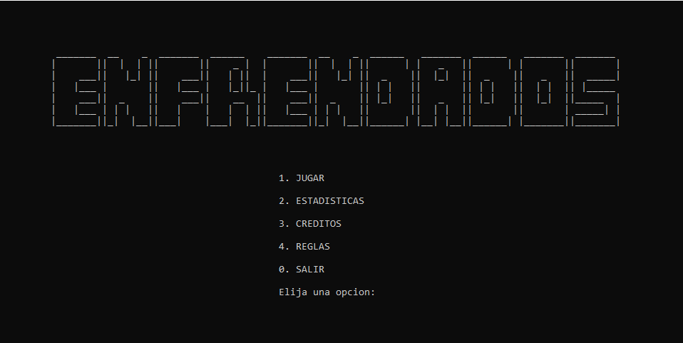

# 🎲 Enfrendados - Juego de Dados en Consola (C++)

**Enfrendados** es un juego de dados por turnos para dos jugadores, desarrollado como **Trabajo Práctico Integrador** para la materia **Programación I** (Técnico Universitario en Programación - UTN, 1C 2025).

Combina azar y cálculo mental, y fue diseñado cumpliendo con todos los requisitos establecidos por la cátedra: estructura modular, uso de vectores, lógica de turnos y aleatoriedad controlada.

---

## 🕹️ Descripción del juego

El juego se juega en 3 rondas entre dos jugadores. En cada turno, el jugador lanza:

- **2 dados de 12 caras** → su suma es el **número objetivo**.
- **Sus dados stock** (dados de 6 caras).

El objetivo es **elegir una combinación de dados del stock que sumen exactamente el número objetivo**. Si lo logra:

- Gana puntos (número objetivo × cantidad de dados elegidos).
- Le transfiere esos dados al rival.
- Si se queda sin dados, gana automáticamente la partida sumando 10.000 puntos.

Si no lo logra:
- El rival le transfiere un dado (solo si tiene más de 1).

---

## ✅ Funcionalidades implementadas

- Interfaz por **consola** con menú principal:
1 - JUGAR
2 - ESTADÍSTICAS
3 - CRÉDITOS
4 - REGLAS
0 - SALIR
- Lógica completa de juego por rondas y turnos.
- Visualización clara del nombre del jugador activo, stock de dados, puntaje acumulado, número objetivo y resultados.
- Sistema de **estadísticas internas** para mostrar un ranking/top de puntajes ordenados de mayor a menor.
- Gestión de **créditos del equipo**.
- Uso de **funciones** y **vectores** para modularizar el código.
- Generación de dados con `rand()` y `srand()`.

  
